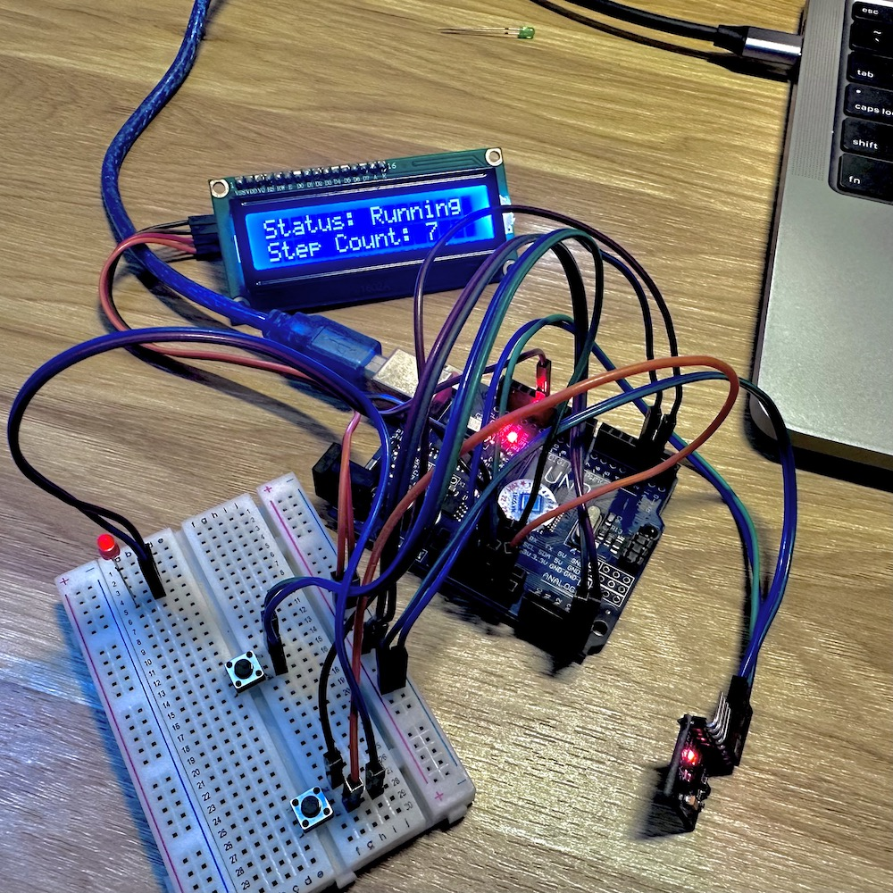

# Pedometer

## Một số linh kiện sử dụng

- Arduino UNO R3
- Mạch chuyển đổi giao tiếp I2C
- Cảm biến gia tốc MPU-6050
- Led LCD 1602A

## Các bước đấu nối thiết bị

**Kết nối MPU6050:**

- Chân VCC của MPU6050 nối với nguồn cấp 5V của Arduino
- Chân GND của MPU6050 nối với chân GND của Arduino
- Chân SDA của MPU6050 nối với chân A4 (SDA) của Arduino
- Chân SCL của MPU6050 nối với chân A5 (SCL) của Arduino

**Kết nối màn hình LCD:**

- Chân VCC của màn hình LCD nối với nguồn cấp 5V của Arduino
- Chân GND của màn hình LCD nối với chân GND của Arduino
- Chân SDA của màn hình LCD nối với chân A4 (SDA) của Arduino
- Chân SCL của màn hình LCD nối với chân A5 (SCL) của Arduino

**Kết nối nút reset:**

- Chân reset của Arduino nối với một nút nhấn (push button)
- Một chân khác của nút nhấn được nối với chân GND của Arduino

## Sản phẩm thực tế

